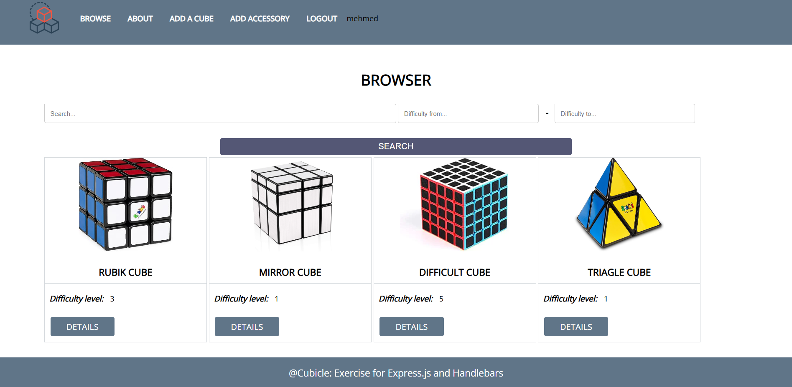

# Cubicle

## :pencil2: About The Project

This is my project for the JS-Web course in SoftUni. It was crated with HTML, CSS, JavaScript, Express and Mongoose. It for users easly Buy and Sale cubes. You have profile page with specific information for you.

<br/>



<br/>

## Installation and usage
 
**Clone respository:**
 
 ```
 https://github.com/KumanStoykov/cubicle-workshop.git
 ```
 
 * To run the app
   <br/>
 ``` 
    npm install
    npm start
 ```

 <br/>

# :earth_asia: Public

The guest pages are:

* Home
* Login
* Register
* Cube for sale
* Details

# :lock: Private

The loggrd-in users are:

* Sell my cube
* Search by query

* **Functionaly**
  <br/>
  :white_medium_small_square: Cube - create, edit, delete.

# :computer:  Built With

## Back-end

- [Express](https://expressjs.com/)
- [Mongoose](https://mongoosejs.com/)
- [JsonWebToken](https://github.com/auth0/node-jsonwebtoken)
- [Bcrypt](https://github.com/kelektiv/node.bcrypt.js)
- [Cookie Parser](https://github.com/expressjs/cookie-parser)
- [Cors](https://github.com/expressjs/cors)
- [Nodemon](https://github.com/remy/nodemon)

## Front-end

- [HTML5](https://developer.mozilla.org/en-US/docs/Glossary/HTML5)
- [CSS](https://developer.mozilla.org/en-US/docs/Web/CSS)
- [Font Awesome](https://fontawesome.com/v5.15/how-to-use/on-the-web/using-with/react)
- [HandleBars](https://github.com/handlebars)
